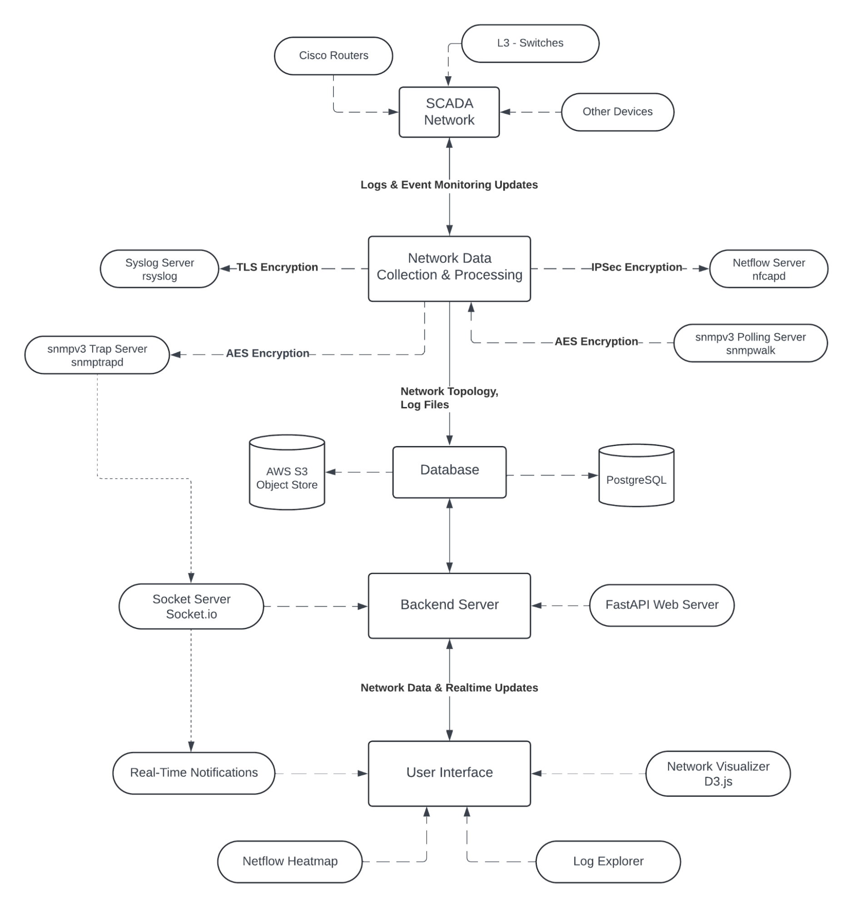

# NetLine
NetLine is a sophisticated tool designed for discovering and visualizing the topology of SCADA (Supervisory Control and Data Acquisition) networks. This user interface, built primarily with TypeScript, provides a seamless and intuitive experience for users to interact with network data, facilitating effective monitoring and management of SCADA systems.

## Table Of Contents

* [Architecture](#architecture)
* [Features](#features)
* [Installation](#installation)
* [Contributing](#contributing)
* [License](#license)

## Architecture



## Features
#### 1. **Network Visualization**
- **Network Visualizer**: Interactive D3.js-based visualization of the entire network topology.  
- **NetFlow Heatmap**: Visualizes router traffic to highlight potential stress points and anomalies.  
- **Log Explorer**: Filterable and detailed insights into network logs for troubleshooting.

#### 2. **Real-Time Monitoring**
- **Real-Time Notifications**: Instant alerts for events via a persistent WebSocket connection.  
- **Heatmaps for SNMP Notifications**: Display critical SNMP data with real-time updates.  
- **Syslog Data Integration**: Collect and visualize syslog data for deeper analysis.

#### 3. **Built-in Tools**
- **Terminal**: Integrated terminal for running commands directly within the application.  
- **Grafana Dashboard**: Pre-configured Grafana dashboards for advanced analytics and monitoring.

#### 4. **Version Control for Network Visualizations**
- Track and manage changes in network visualization with built-in version control support.

## Installation

#### FRONTEND SETUP
- Clone the repository:  
   `git clone https://github.com/Naman-B-Parlecha/NetLine.git`

- Navigate to the project directory:  
   `cd NetLine`

### Install Dependencies
```bash
npm install
```

### Run the Development Server
```bash
npm run dev
```

#### BACKEND SETUP
Follow the following repository's readme guide : 
[Infra-1708](https://github.com/LAN-Lords/infra-1708/blob/main/README.md)

## Contributing

Contributions are welcome and appreciated! If you'd like to contribute to **NetLine**, please follow these steps:

-  **Fork the Repository**: Click the "Fork" button in the top-right corner of this repository.
-  **Clone Your Fork**:  
   ```bash
   git clone https://github.com/your-username/NetLine.git

- **Create a New Branch**:
   ```bash
      git checkout -b feature/YourFeatureName

- **Make Your Changes**: Implement your feature or fix an issue.
- **Test Your Changes**: Ensure your code works as intended and does not break existing functionality.
- **Push to Your Fork**:
   ```bash
   git push origin feature/YourFeatureName
- **Submit a Pull Request**: Navigate to this repository and click "New Pull Request" to propose your changes.

## License

Distributed under the MIT License. See [LICENSE](https://github.com/Naman-Parlecha/NetLine/blob/main/LICENSE.md) for more information.

